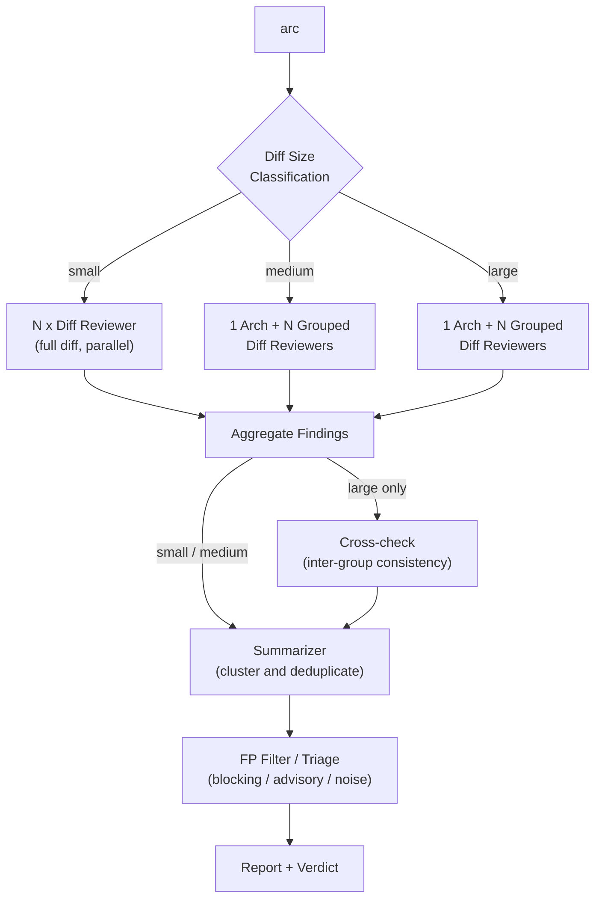

# ARC - Adaptive code-Review Coordinator

A CLI tool that runs parallel AI-powered code reviews using LLM agents ([Codex](https://github.com/openai/codex), [Claude Code](https://github.com/anthropics/claude-code), or [Gemini CLI](https://github.com/google-gemini/gemini-cli)) and aggregates findings intelligently.

ARC is a hard fork of Rich Haase's original Agentic Code Reviewer project, renamed and adapted as Adaptive code-Review Coordinator for the Windows-native path.

**[日本語版 README はこちら](README_JP.md)**

<!-- Uncomment after recording the demo:
<p align="center">
  
</p>
-->

## Quick Start

```bash
# Install ARC
go install github.com/masa6161/arc-cli/cmd/arc@latest

# Install at least one LLM CLI (Codex shown here)
brew install codex

# Run a review in your repo
cd your-repo
arc
```

On Windows, use the source install or the release ZIP described below.

## Prerequisites

### Required

| Tool | Version | Installation | Purpose |
|------|---------|--------------|---------|
| Git  |         | [git-scm.com](https://git-scm.com) | ARC invokes `git` at runtime for diff, fetch, and repo detection |
| Go   | >= 1.25 | [go.dev/dl](https://go.dev/dl) | Required only for building from source (`go install`) |

You also need **at least one** of the following LLM CLIs installed and authenticated:

| Agent | Installation | Authentication |
|-------|--------------|----------------|
| Codex | [github.com/openai/codex](https://github.com/openai/codex) (default) | Set `OPENAI_API_KEY` or run `codex auth` |
| Claude Code | [github.com/anthropics/claude-code](https://github.com/anthropics/claude-code) | Run `claude login` |
| Gemini CLI | [github.com/google-gemini/gemini-cli](https://github.com/google-gemini/gemini-cli) | Set `GEMINI_API_KEY` or run `gemini auth login` |

### Optional

| Tool | Installation | Purpose |
|------|--------------|---------|
| gh CLI | [cli.github.com](https://cli.github.com) | Post reviews to GitHub PRs |

## How It Works

ARC automatically classifies the diff size (small / medium / large) and selects an appropriate review strategy:

- **Small** diffs get a flat parallel review — N reviewers each see the full diff.
- **Medium** diffs split into an architecture review (full diff) plus grouped diff reviews where each reviewer covers a subset of files.
- **Large** diffs use the same arch + grouped structure as medium, and additionally run a cross-check phase that verifies consistency across file groups.

After all reviewers complete, ARC aggregates findings, runs an LLM summarizer to cluster and deduplicate, then applies a false-positive filter with severity triage (blocking / advisory / noise) before presenting the final verdict.



| Size | Reviewers | Cross-check | Typical use |
|------|-----------|-------------|-------------|
| small | N flat diff reviewers | No | Few files, small changes |
| medium | 1 arch + N grouped diff reviewers | No | Moderate changes across multiple files |
| large | 1 arch + N grouped diff reviewers | Yes | Many files, large-scale changes |

> **Fallback behavior**: medium and large diffs require at least 2 splittable file groups for the grouped review path. When fewer groups are available, ARC falls back to a medium flat review (1 arch + N diff reviewers on the full diff) and cross-check is skipped.

## Installation

`go install` places the binary in Go's bin directory (`$GOPATH/bin` or `$GOBIN`). Ensure this directory is in your `PATH`:

- **macOS / Linux**: typically `~/go/bin` — add `export PATH="$PATH:$(go env GOPATH | cut -d: -f1)/bin"` to your shell profile
- **Windows**: typically `%USERPROFILE%\go\bin` — the Go installer usually adds this to `PATH`; if not, add it via System Settings > Environment Variables

### Source (macOS / Linux)

```bash
go install github.com/masa6161/arc-cli/cmd/arc@latest
```

### Windows

ARC works on Windows native with `codex`, `claude`, or `gemini` as the review backend.

#### From Source

```powershell
go install github.com/masa6161/arc-cli/cmd/arc@latest
arc --help
```

#### Direct Download

Download the Windows release ZIP from GitHub Releases and extract `arc.exe` to a directory in your `PATH`.

## Usage

```bash
# Review current branch against main with 5 parallel reviewers
arc

# Review with custom settings
arc --reviewers 10 --base develop --timeout 10m

# Verbose mode (show reviewer messages as they arrive)
arc --verbose
```

### Auto-phase (default) vs flat review

By default, ARC automatically selects review phases based on diff size ("auto-phase"). Large diffs are split into an architecture review plus per-file-group diff reviews; small diffs use a single flat diff pass.

To run a flat (single big diff × N reviewers) review instead:

| Method | How |
|---|---|
| Ad-hoc flag | `arc --phase small` |
| Disable auto-phase for one run | `arc --no-auto-phase` |
| Persistent opt-out in project | `.arc.yaml`: `auto_phase: false` |
| Persistent opt-out via env | `ARC_AUTO_PHASE=false arc` |

Using `--phase medium` forces both phases explicitly (arch + diff) without grouping, regardless of diff size.

The verdict field (`ok` / `advisory` / `blocking`) and exit-code policy apply on both paths. Use `--strict` to treat advisory findings as blocking (exit 1).

### Options

| Flag                | Short | Default | Description                              |
| ------------------- | ----- | ------- | ---------------------------------------- |
| `--reviewers`       | `-r`  | 5       | Number of parallel reviewers             |
| `--concurrency`     | `-c`  | -r      | Max concurrent reviewers (see below)     |
| `--base`            | `-b`  | main    | Base ref for diff comparison             |
| `--timeout`         | `-t`  | 10m     | Timeout per reviewer                     |
| `--retries`         | `-R`  | 1       | Retry failed reviewers N times           |
| `--verbose`         | `-v`  | false   | Print agent messages in real-time        |
| `--fetch/--no-fetch`|       | true    | Fetch base ref from origin before diff   |
| `--no-fp-filter`    |       | false   | Disable false positive filtering          |
| `--fp-threshold`    |       | 75      | False positive confidence threshold 1-100 |
| `--guidance`        |       |         | Steering context appended to review prompt (env: ARC_GUIDANCE) |
| `--guidance-file`   |       |         | Path to file containing review guidance (env: ARC_GUIDANCE_FILE) |
| `--ref-file`        |       | false   | Write diff to temp file instead of embedding in prompt (auto for large diffs) |
| `--exclude-pattern` |       |         | Exclude findings matching regex (repeat)  |
| `--no-config`       |       | false   | Skip loading .arc.yaml config file        |
| `--reviewer-agent`  | `-a`  | codex   | Agent(s) for reviews, comma-separated (codex, claude, gemini) |
| `--arch-reviewer-agent`|    |         | Single agent for arch phase in auto-phase grouped diff (default: first --reviewer-agent) |
| `--diff-reviewer-agents`|   |         | Agent(s) for diff phase in auto-phase grouped diff, comma-separated (default: same as --reviewer-agent) |
| `--summarizer-agent`| `-s`  | codex   | Agent for summarization (codex, claude, gemini) |
| `--reviewer-model`  |       |         | LLM model for review agents (env: ARC_REVIEWER_MODEL) |
| `--summarizer-model`|       |         | LLM model for summarizer/FP filter agents (env: ARC_SUMMARIZER_MODEL) |
| `--auto-phase`/`--no-auto-phase`| | true | Auto-select review phases based on diff size (env: ARC_AUTO_PHASE) |
| `--phase`           |       |         | Override auto-phase: small, medium, large  |
| `--large-diff-reviewers`|   | 4       | Number of diff reviewers in auto-phase grouped path (large diff) |
| `--medium-diff-reviewers`|  | 2       | Number of diff reviewers for auto-phase medium and --phase medium |
| `--small-diff-reviewers`|   | 1       | Number of reviewers for auto-phase small and --phase small |
| `--role-prompts`/`--no-role-prompts`| | true | Use role-specific prompts for auto-phase diff/arch reviewers |
| `--summarizer-timeout`|     | 5m      | Timeout for summarizer phase              |
| `--fp-filter-timeout`|      | 5m      | Timeout for false positive filter phase   |
| `--no-cross-check`  |       | false   | Disable cross-group consistency verification |
| `--cross-check-agent`|      |         | Agent(s) for cross-check verification, comma-separated (default: same as --summarizer-agent) |
| `--cross-check-model`|      |         | LLM model(s) for cross-check, comma-separated (REQUIRED when cross-check enabled) |
| `--cross-check-timeout`|    | 5m      | Timeout for cross-check phase             |
| `--fp-filter-agent` |       |         | Agent for FP filter/triage (default: same as --summarizer-agent, env: ARC_FP_FILTER_AGENT) |
| `--fp-filter-model` |       |         | LLM model for FP filter/triage (default: same as --summarizer-model, env: ARC_FP_FILTER_MODEL) |
| `--fp-filter-effort`|       |         | Reasoning effort for FP filter/triage (env: ARC_FP_FILTER_EFFORT) |
| `--no-triage`       |       | false   | Disable severity triage (FP-only mode, env: ARC_TRIAGE=false) |
| `--show-noise`      |       | false   | Show noise-level findings that are normally hidden (env: ARC_SHOW_NOISE) |
| `--strict`          |       | false   | Exit 1 on any advisory verdict            |
| `--format`          |       | text    | Output format: text or json               |

### Concurrency Control

The `--concurrency` flag limits how many reviewers run simultaneously, independent of the total reviewer count. This helps avoid API rate limits when running many reviewers or using high retry counts.

```bash
# Run 15 total reviewers, but only 5 at a time
arc -r 15 -c 5

# With retries, -c prevents retry storms from overwhelming the API
arc -r 10 -R 3 -c 3
```

By default, concurrency equals the reviewer count (all run in parallel).

### Agent Selection

ARC supports multiple AI backends for code review:

| Agent | CLI | Description |
|-------|-----|-------------|
| `codex` | [Codex](https://github.com/openai/codex) | Default. Uses built-in `codex exec review` |
| `claude` | [Claude Code](https://github.com/anthropics/claude-code) | Anthropic's Claude via CLI |
| `gemini` | [Gemini CLI](https://github.com/google-gemini/gemini-cli) | Google's Gemini via CLI |

```bash
# Use Claude instead of Codex for reviews
arc --reviewer-agent claude

# Use Gemini for reviews
arc -a gemini

# Use different agents for review and summarization
arc --reviewer-agent gemini --summarizer-agent claude

# Use multiple agents in round-robin (reviewers alternate between agents)
arc -r 6 --reviewer-agent codex,claude,gemini

# Override the model used by review agents
arc --reviewer-agent claude --reviewer-model sonnet-4

# Use different models for review and summarization
arc --reviewer-agent claude --reviewer-model opus-4 \
    --summarizer-agent claude --summarizer-model haiku-4
```

Different agents may find different issues. When multiple agents are specified (comma-separated), reviewers are assigned to agents in round-robin order. The appropriate CLI must be installed and authenticated for all selected agents.

### Review Guidance

Steer reviews with additional context without replacing the built-in prompts:

```bash
# Inline guidance
arc --guidance "Focus on security vulnerabilities and auth issues"

# Guidance from file
arc --guidance-file .arc-guidance.md
```

Guidance is appended to the default review prompts, preserving the tuned output format and skip rules. Use it to provide domain context, focus areas, or project conventions.

### Environment Variables

| Variable                  | Description                              |
| ------------------------- | ---------------------------------------- |
| `ARC_REVIEWERS`           | Default number of reviewers              |
| `ARC_CONCURRENCY`         | Default max concurrent reviewers         |
| `ARC_BASE_REF`            | Default base ref                         |
| `ARC_TIMEOUT`             | Default timeout (e.g., "5m" or "300")    |
| `ARC_RETRIES`             | Default retry count                      |
| `ARC_FETCH`               | Fetch base ref from origin (true/false)  |
| `ARC_FP_FILTER`           | Enable false positive filtering (true/false) |
| `ARC_FP_THRESHOLD`        | False positive confidence threshold 1-100 |
| `ARC_REVIEWER_AGENT`      | Default reviewer agent(s), comma-separated |
| `ARC_ARCH_REVIEWER_AGENT` | Single agent for arch phase in auto-phase grouped diff |
| `ARC_DIFF_REVIEWER_AGENTS`| Agent(s) for diff phase in auto-phase grouped diff |
| `ARC_SUMMARIZER_AGENT`    | Default summarizer agent  |
| `ARC_REVIEWER_MODEL`      | LLM model for review agents                |
| `ARC_SUMMARIZER_MODEL`    | LLM model for summarizer/FP filter agents  |
| `ARC_CODEX_HOME`          | Codex home directory passed to `codex` subprocesses; set as a user environment variable, not in `.arc.yaml` |
| `CODEX_HOME`              | Fallback Codex home directory when `ARC_CODEX_HOME` is unset |
| `ARC_SUMMARIZER_TIMEOUT`  | Timeout for summarizer phase (e.g., "5m" or "300") |
| `ARC_FP_FILTER_TIMEOUT`   | Timeout for false positive filter phase (e.g., "5m" or "300") |
| `ARC_AUTO_PHASE`          | Enable auto-phase selection (true/false)   |
| `ARC_LARGE_DIFF_REVIEWERS`| Number of diff reviewers for auto-phase large path |
| `ARC_MEDIUM_DIFF_REVIEWERS`| Number of diff reviewers for auto-phase medium path |
| `ARC_SMALL_DIFF_REVIEWERS`| Number of reviewers for auto-phase small path |
| `ARC_ROLE_PROMPTS`        | Enable role-specific prompts (true/false)  |
| `ARC_CROSS_CHECK`         | Enable cross-group consistency verification (true/false) |
| `ARC_CROSS_CHECK_AGENT`   | Agent(s) for cross-check verification      |
| `ARC_CROSS_CHECK_MODEL`   | LLM model(s) for cross-check               |
| `ARC_CROSS_CHECK_TIMEOUT` | Timeout for cross-check phase (e.g., "5m" or "300") |
| `ARC_FP_FILTER_AGENT`     | Agent for FP filter/triage (default: same as summarizer) |
| `ARC_FP_FILTER_MODEL`     | LLM model for FP filter/triage             |
| `ARC_FP_FILTER_EFFORT`    | Reasoning effort for FP filter/triage      |
| `ARC_TRIAGE`              | Enable severity triage in FP filter (true/false) |
| `ARC_SHOW_NOISE`          | Show noise-level findings (true/false)     |
| `ARC_STRICT`              | Exit 1 on any advisory verdict (true/false) |
| `ARC_GUIDANCE`            | Steering context appended to review prompt |
| `ARC_GUIDANCE_FILE`       | Path to file containing review guidance    |

Codex auth home is intentionally operator-controlled. On Windows, prefer a User
environment variable and restart the terminal/agent process so child `codex`
processes inherit it:

```powershell
[Environment]::SetEnvironmentVariable("ARC_CODEX_HOME", "C:\Users\<you>\.arc-codex-home", "User")
```

## Configuration

ARC's behavior varies significantly across agent backends (Codex, Claude, Gemini) and auto-phase sizes (small, medium, large) — each combination may need different models, effort levels, and timeout settings. We strongly recommend using a `.arc.yaml` config file rather than relying on CLI flags alone.

Copy the [`.arc.yaml`](.arc.yaml) from this repository as a starting point and customize it for your project:

```bash
curl -o .arc.yaml https://raw.githubusercontent.com/masa6161/arc-cli/main/.arc.yaml
```

All fields are optional — defaults are used for anything not specified:

```yaml
# All fields are optional - defaults shown in comments
reviewers: 5              # Number of parallel reviewers
concurrency: 5            # Max concurrent reviewers (defaults to reviewers)
base: main                # Base ref for diff comparison
timeout: 10m              # Timeout per reviewer (supports "5m", "300s", or 300)
retries: 1                # Retry failed reviewers N times
fetch: true               # Fetch base ref from origin before diff

# Agent selection
# reviewer_agent: codex   # Single agent for reviews (codex, claude, gemini)
# reviewer_agents:        # Multiple agents for round-robin assignment
#   - codex
#   - claude
#   - gemini
# summarizer_agent: codex # Agent for summarization (codex, claude, gemini)
# Codex home is intentionally not configurable in .arc.yaml because repository
# config is shared. Set ARC_CODEX_HOME as a user environment variable instead.
# Precedence: ARC_CODEX_HOME > CODEX_HOME > USERPROFILE/HOME/.codex
# reviewer_model: ""      # LLM model override for review agents
# summarizer_model: ""    # LLM model override for summarizer/FP filter agents
summarizer_timeout: 5m    # Timeout for summarizer phase
fp_filter_timeout: 5m     # Timeout for false positive filter phase

# Auto-phase settings
auto_phase: true          # Auto-select review phases based on diff size
role_prompts: true        # Use role-specific prompts for auto-phase diff/arch reviewers
# arch_reviewer_agent: "" # Single agent for arch phase (default: first reviewer_agent)
# diff_reviewer_agents:   # Agent(s) for diff phase, round-robin (default: same as reviewer_agents)
#   - codex
#   - claude
large_diff_reviewers: 4   # Number of diff reviewers in auto-phase large path
medium_diff_reviewers: 2  # Number of diff reviewers in auto-phase medium path
small_diff_reviewers: 1   # Number of reviewers in auto-phase small path
# min_large_diff_reviewers: 2   # Minimum diff reviewers for large path (must be >= 2, default: 2)
# min_medium_diff_reviewers: 2  # Minimum diff reviewers for medium path (must be >= 2, default: 2)

# Review guidance (appended to built-in prompts)
# guidance_file: .arc-guidance.md

filters:
  exclude_patterns:       # Regex patterns to exclude from findings
    - "Next\\.js forbids"
    - "deprecated API"
    - "consider using"

fp_filter:
  enabled: true           # Enable LLM-based false positive filtering
  threshold: 75           # Confidence threshold 1-100 (100 = definitely false positive)
  triage: true            # Enable severity triage (blocking/advisory/noise)
  show_noise: false       # Show noise-level findings in output
  # agent: ""             # Agent for FP filter/triage (default: same as summarizer_agent)
  # model: ""             # LLM model for FP filter/triage (default: same as summarizer_model)
  # effort: ""            # Reasoning effort for FP filter/triage

# Cross-check is enabled by default. It runs only on large diffs with >=2 file groups.
# When enabled, a model is REQUIRED (via cross_check.model or models matrix).
cross_check:
  enabled: true           # Cross-group consistency verification (large diffs only)
  # agent: ""             # Agent(s) for cross-check, comma-separated (default: same as summarizer_agent)
  model: "gpt-5.4"        # REQUIRED when enabled (or supply via models.*.cross_check.model)
# cross_check_timeout: 5m  # Timeout for cross-check phase

```

### Model matrix (optional)

Per-role, per-size, and per-agent model/effort overrides can be set under a `models:` key. All three layers are optional and cascade: `agents` > `sizes` > `defaults` > legacy flat fields (`reviewer_model`, `summarizer_model`, etc.) > agent built-in default.

```yaml
# Optional: per-size / per-role / per-agent model and thinking-effort matrix.
# All three layers are optional and cascade: agents > sizes > defaults > legacy.
# Unset fields fall back to lower layers, then to the agent's built-in default.
models:
  defaults:
    reviewer:       { model: gpt-5.4-mini, effort: medium }
    arch_reviewer:  { model: gpt-5.4,      effort: high }   # auto-phase arch only
    diff_reviewer:  { model: gpt-5.4-mini, effort: medium } # auto-phase diff only
    summarizer:     { model: gpt-5.4,      effort: high }
    fp_filter:      { model: gpt-5.4-mini, effort: low }
    cross_check:    { model: gpt-5.4,      effort: medium }
  sizes:
    large:
      arch_reviewer: { model: gpt-5.4,     effort: high }
      diff_reviewer: { model: gpt-5.4,     effort: medium }
      summarizer:    { model: gpt-5.4,     effort: high }
  agents:
    codex:
      arch_reviewer: { effort: high }
      diff_reviewer: { effort: medium }
    claude:
      reviewer:   { model: sonnet-4-6,   effort: high }
```

**`arch_reviewer` / `diff_reviewer` phase-specific roles**: when auto-phase enters a multi-phase run (`medium`/`large` diffs → `arch` + `diff` phases), the phase-specific reviewer role is consulted first at each cascade layer, falling back to the generic `reviewer` role at the *same* layer before descending. Flat review paths (auto-phase OFF, `size=small`, or explicit `--phase small`) ignore these keys and use `reviewer` only. Legacy flat fields (`reviewer_model`, etc.) apply as the generic reviewer fallback only — there is no `arch_reviewer_model` legacy field.

**`effort` field behavior by agent:**
- **codex**: `low`, `medium`, or `high` map to `-c model_reasoning_effort=<value>` (codex CLI's config override; there is no `--reasoning-effort` flag). Unknown values are ignored.
- **claude**: `low`, `medium`, `high`, `xhigh`, or `max` map to `--effort <value>` (session-scoped; available levels depend on the model). Other values (including numeric strings) are silently dropped.
- **gemini**: effort is not supported and is silently ignored.

When `models:` is absent, the legacy flat fields (`reviewer_model`, `summarizer_model`, etc.) remain fully functional as before. Use `--verbose` to see the resolved effective matrix at runtime.

### Precedence

Configuration is resolved with the following precedence (highest to lowest):
1. CLI flags (e.g., `--reviewers 10`)
2. Environment variables (e.g., `ARC_REVIEWERS=10`)
3. `models.agents.<agent>.<role>` in `.arc.yaml`
4. `models.sizes.<size>.<role>` in `.arc.yaml`
5. `models.defaults.<role>` in `.arc.yaml`
6. Legacy flat fields (`reviewer_model`, `summarizer_model`, etc.) in `.arc.yaml`
7. Built-in defaults

### Behavior

- Config file is loaded from the git repository root
- Missing config file is not an error (empty defaults used)
- Invalid YAML or regex patterns produce an error
- Unknown keys in config file produce a warning with "did you mean?" suggestions
- CLI `--exclude-pattern` flags are merged with config patterns (union)
- Use `--no-config` to skip loading the config file for a single run

## Exit Codes

| Code | Meaning                      |
| ---- | ---------------------------- |
| 0    | No findings                  |
| 1    | Findings found               |
| 2    | Error                        |
| 130  | Interrupted (SIGINT/SIGTERM) |

## Development

### Unix / macOS

```bash
# List available targets
make help

# Build with version info (outputs to bin/)
make build

# Run all quality checks (format, lint, vet, staticcheck, tests)
make check

# Run tests
make test

# Run linter
make lint

# Run staticcheck
make staticcheck

# Run go vet
make vet

# Format code
make fmt

# Tidy go.mod
make tidy

# Run tests with coverage
make test-coverage

# Find dead code
make find-deadcode

# Clean build artifacts
make clean
```

### Windows (PowerShell)

```powershell
go test ./...
go build ./cmd/arc
go install ./cmd/arc
```

See [CONTRIBUTING.md](CONTRIBUTING.md) for contribution guidelines.

## License

Apache License 2.0 - see [LICENSE](LICENSE)
