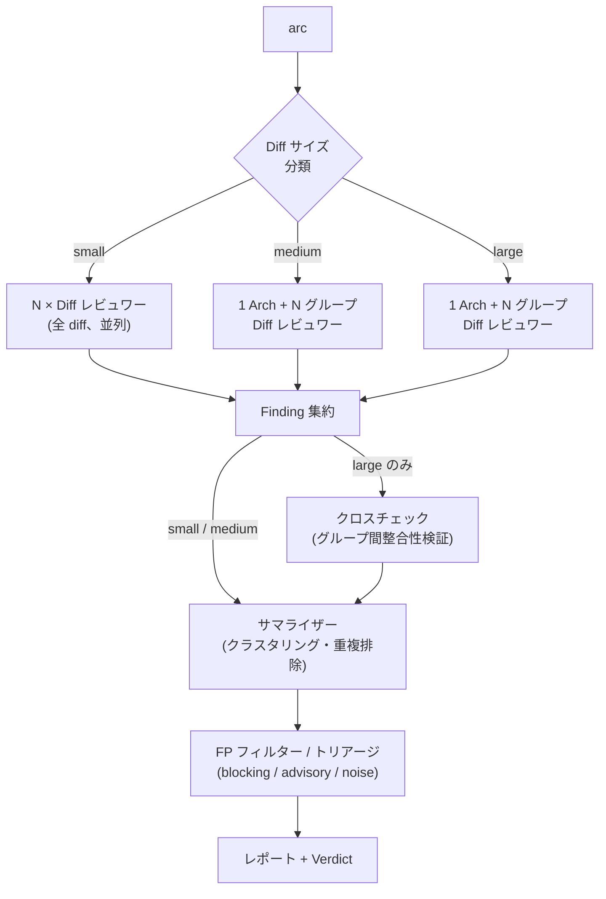

# ARC - Adaptive code-Review Coordinator

LLM エージェント（[Codex](https://github.com/openai/codex)、[Claude Code](https://github.com/anthropics/claude-code)、[Gemini CLI](https://github.com/google-gemini/gemini-cli)）を使用して並列 AI コードレビューを実行し、結果をインテリジェントに集約する CLI ツールです。

ARC は Rich Haase 氏の Agentic Code Reviewer プロジェクトの hard fork であり、Adaptive code-Review Coordinator として Windows ネイティブ対応にリネーム・適応したものです。

**[English README](README.md)**

<!-- デモ動画を録画したらコメント解除:
<p align="center">
  
</p>
-->

## クイックスタート

```bash
# ARC をインストール
go install github.com/masa6161/arc-cli/cmd/arc@latest

# LLM CLI を少なくとも 1 つインストール（Codex の例）
brew install codex

# リポジトリ内でレビューを実行
cd your-repo
arc
```

Windows では、以下のソースインストールまたはリリース ZIP を使用してください。

## 前提条件

### 必須

| ツール | バージョン | インストール | 用途 |
|--------|-----------|-------------|------|
| Git    |           | [git-scm.com](https://git-scm.com) | ARC は実行時に `git` を使用して diff、fetch、リポジトリ検出を行います |
| Go     | >= 1.25   | [go.dev/dl](https://go.dev/dl) | ソースからのビルド時のみ必要（`go install`） |

さらに、以下の LLM CLI のうち**少なくとも 1 つ**をインストール・認証する必要があります:

| エージェント | インストール | 認証方法 |
|-------------|-------------|---------|
| Codex | [github.com/openai/codex](https://github.com/openai/codex)（デフォルト） | `OPENAI_API_KEY` を設定 or `codex auth` を実行 |
| Claude Code | [github.com/anthropics/claude-code](https://github.com/anthropics/claude-code) | `claude login` を実行 |
| Gemini CLI | [github.com/google-gemini/gemini-cli](https://github.com/google-gemini/gemini-cli) | `GEMINI_API_KEY` を設定 or `gemini auth login` を実行 |

> **Claude Code の課金に関する注意:** ARC は Claude Code を `--print` フラグ（非インタラクティブモード）で起動します。1 回の ARC 実行で複数の非インタラクティブ Claude セッションが発生する場合があります（N 個のレビューア + サマライザー + FP フィルター）。2026 年 6 月 15 日以降、サブスクリプション認証での `claude -p` および Agent SDK の利用は Agent SDK クレジットから消費されます。クレジットが枯渇した場合、アカウントで有効になっていれば extra usage（API 従量課金）に移行します。`ANTHROPIC_API_KEY` による認証では、従来通り API の従量課金が適用されます。大規模なレビューを実行する前に、プランのクレジット残高と課金設定をご確認ください。詳細は [Agent SDK プラン課金](https://support.claude.com/en/articles/15036540-use-the-claude-agent-sdk-with-your-claude-plan) および [`claude -p` ドキュメント](https://code.claude.com/docs/en/headless) を参照してください。

### オプション

| ツール | インストール | 用途 |
|--------|-------------|------|
| gh CLI | [cli.github.com](https://cli.github.com) | GitHub PR にレビューを投稿 |

## 動作の仕組み

ARC は diff のサイズ（small / medium / large）を自動分類し、適切なレビュー戦略を選択します:

- **Small**（小規模）: フラットな並列レビュー — N 台のレビュワーがそれぞれ全 diff を確認します。
- **Medium**（中規模）: アーキテクチャレビュー（全 diff）とグループ化された diff レビュー（各レビュワーがファイルのサブセットを担当）に分割します。
- **Large**（大規模）: medium と同じ arch + グループ構成に加え、ファイルグループ間の整合性を検証するクロスチェックフェーズを実行します。

全レビュワーの完了後、ARC は finding を集約し、LLM サマライザーでクラスタリング・重複排除を行い、誤検出フィルター＋重要度トリアージ（blocking / advisory / noise）を適用して最終的な verdict を提示します。



| サイズ | レビュワー構成 | クロスチェック | 典型的な用途 |
|--------|--------------|--------------|-------------|
| small | N 台の flat diff レビュワー | なし | 少数ファイル、小規模変更 |
| medium | 1 arch + N グループ diff レビュワー | なし | 複数ファイルにまたがる中規模変更 |
| large | 1 arch + N グループ diff レビュワー | あり | 多数ファイル、大規模変更 |

> **フォールバック挙動**: medium および large の diff では、グループ化レビューパスに少なくとも 2 つの分割可能なファイルグループが必要です。利用可能なグループが不足する場合、ARC は medium フラットレビュー（1 arch + N diff レビュワーが全 diff を対象）にフォールバックし、クロスチェックはスキップされます。

## インストール

`go install` はバイナリを Go の bin ディレクトリ（`$GOPATH/bin` または `$GOBIN`）に配置します。このディレクトリが `PATH` に含まれていることを確認してください:

- **macOS / Linux**: 通常 `~/go/bin` — シェルプロファイルに `export PATH="$PATH:$(go env GOPATH | cut -d: -f1)/bin"` を追加
- **Windows**: 通常 `%USERPROFILE%\go\bin` — Go インストーラーが `PATH` に追加済みの場合が多いですが、追加されていない場合はシステム設定 > 環境変数から追加

### ソースから（macOS / Linux）

```bash
go install github.com/masa6161/arc-cli/cmd/arc@latest
```

### Windows

ARC は `codex`、`claude`、`gemini` をレビューバックエンドとして Windows ネイティブで動作します。

#### ソースから

```powershell
go install github.com/masa6161/arc-cli/cmd/arc@latest
arc --help
```

#### ダイレクトダウンロード

GitHub Releases から Windows リリース ZIP をダウンロードし、`arc.exe` を `PATH` の通ったディレクトリに配置してください。

## 使い方

```bash
# main に対して 5 台の並列レビュワーでレビュー
arc

# カスタム設定でレビュー
arc --reviewers 10 --base develop --timeout 10m

# Verbose モード（レビュワーのメッセージをリアルタイム表示）
arc --verbose
```

### 自動フェーズ（デフォルト）vs フラットレビュー

デフォルトでは、ARC は diff サイズに基づいてレビューフェーズを自動選択します（「auto-phase」）。大規模 diff はアーキテクチャレビュー＋ファイルグループ別 diff レビューに分割され、小規模 diff は単一のフラット diff パスを使用します。

フラット（単一の大きな diff × N レビュワー）レビューを実行するには:

| 方法 | 手順 |
|------|------|
| 一時フラグ | `arc --phase small` |
| 1 回のみ auto-phase を無効化 | `arc --no-auto-phase` |
| プロジェクトで永続的にオプトアウト | `.arc.yaml`: `auto_phase: false` |
| 環境変数で永続的にオプトアウト | `ARC_AUTO_PHASE=false arc` |

`--phase medium` を使用すると、diff サイズに関係なく両フェーズ（arch + diff）を明示的に強制します（グルーピングなし）。

verdict フィールド（`ok` / `advisory` / `blocking`）と終了コードポリシーは両パスに適用されます。`--strict` を使用すると advisory の finding も blocking として扱います（exit 1）。

### オプション

| フラグ               | 短縮形 | デフォルト | 説明                                    |
| ------------------- | ----- | --------- | --------------------------------------- |
| `--reviewers`       | `-r`  | 5         | 並列レビュワー数                          |
| `--concurrency`     | `-c`  | -r        | 最大同時実行レビュワー数（下記参照）         |
| `--base`            | `-b`  | main      | diff 比較のベースリファレンス              |
| `--timeout`         | `-t`  | 10m       | レビュワーごとのタイムアウト               |
| `--retries`         | `-R`  | 1         | 失敗したレビュワーのリトライ回数            |
| `--verbose`         | `-v`  | false     | エージェントメッセージをリアルタイム表示      |
| `--fetch/--no-fetch`|       | true      | diff 前に origin からベースリファレンスを fetch |
| `--no-fp-filter`    |       | false     | 誤検出フィルタリングを無効化               |
| `--fp-threshold`    |       | 75        | 誤検出信頼度しきい値 1-100               |
| `--guidance`        |       |           | レビュープロンプトに追加するコンテキスト（env: ARC_GUIDANCE） |
| `--guidance-file`   |       |           | レビューガイダンスファイルのパス（env: ARC_GUIDANCE_FILE） |
| `--ref-file`        |       | false     | diff をプロンプト埋め込みの代わりに一時ファイルに書き出し（大規模 diff では自動） |
| `--exclude-pattern` |       |           | 正規表現に一致する finding を除外（繰り返し可） |
| `--no-config`       |       | false     | .arc.yaml 設定ファイルの読み込みをスキップ  |
| `--reviewer-agent`  | `-a`  | codex     | レビュー用エージェント、カンマ区切り（codex, claude, gemini） |
| `--arch-reviewer-agent`|    |           | auto-phase グループ diff の arch フェーズ用エージェント（デフォルト: 最初の --reviewer-agent） |
| `--diff-reviewer-agents`|   |           | auto-phase グループ diff の diff フェーズ用エージェント、カンマ区切り（デフォルト: --reviewer-agent と同じ） |
| `--summarizer-agent`| `-s`  | codex     | サマリー用エージェント（codex, claude, gemini） |
| `--reviewer-model`  |       |           | レビューエージェント用 LLM モデル（env: ARC_REVIEWER_MODEL） |
| `--summarizer-model`|       |           | サマライザー/FP フィルター用 LLM モデル（env: ARC_SUMMARIZER_MODEL） |
| `--auto-phase`/`--no-auto-phase`| | true | diff サイズに基づくレビューフェーズの自動選択（env: ARC_AUTO_PHASE） |
| `--phase`           |       |           | auto-phase をオーバーライド: small, medium, large |
| `--large-diff-reviewers`|   | 4         | auto-phase large パスの diff レビュワー数 |
| `--medium-diff-reviewers`|  | 2         | auto-phase medium および --phase medium の diff レビュワー数 |
| `--small-diff-reviewers`|   | 1         | auto-phase small および --phase small のレビュワー数 |
| `--role-prompts`/`--no-role-prompts`| | true | auto-phase の diff/arch レビュワーにロール固有プロンプトを使用 |
| `--summarizer-timeout`|     | 5m        | サマライザーフェーズのタイムアウト          |
| `--fp-filter-timeout`|      | 5m        | 誤検出フィルターフェーズのタイムアウト       |
| `--no-cross-check`  |       | false     | グループ間整合性検証を無効化               |
| `--cross-check-agent`|      |           | クロスチェック用エージェント、カンマ区切り（デフォルト: --summarizer-agent と同じ） |
| `--cross-check-model`|      |           | クロスチェック用 LLM モデル、カンマ区切り（クロスチェック有効時は必須） |
| `--cross-check-timeout`|    | 5m        | クロスチェックフェーズのタイムアウト         |
| `--fp-filter-agent` |       |           | FP フィルター/トリアージ用エージェント（デフォルト: --summarizer-agent と同じ、env: ARC_FP_FILTER_AGENT） |
| `--fp-filter-model` |       |           | FP フィルター/トリアージ用 LLM モデル（デフォルト: --summarizer-model と同じ、env: ARC_FP_FILTER_MODEL） |
| `--fp-filter-effort`|       |           | FP フィルター/トリアージの推論 effort（env: ARC_FP_FILTER_EFFORT） |
| `--no-triage`       |       | false     | 重要度トリアージを無効化（FP のみモード、env: ARC_TRIAGE=false） |
| `--show-noise`      |       | false     | 通常非表示の noise レベル finding を表示（env: ARC_SHOW_NOISE） |
| `--strict`          |       | false     | advisory verdict で exit 1 を返す         |
| `--format`          |       | text      | 出力形式: text or json                   |

### 同時実行制御

`--concurrency` フラグは、レビュワー総数とは独立して同時実行数を制限します。多数のレビュワーを実行する場合や、高いリトライ回数を設定する場合の API レート制限回避に役立ちます。

```bash
# 合計 15 レビュワー、同時実行は 5 まで
arc -r 15 -c 5

# リトライ時、-c でリトライストームによる API 過負荷を防止
arc -r 10 -R 3 -c 3
```

デフォルトでは、同時実行数はレビュワー数と同じです（全員が並列実行）。

### エージェント選択

ARC は複数の AI バックエンドをサポートしています:

| エージェント | CLI | 説明 |
|-------------|-----|------|
| `codex` | [Codex](https://github.com/openai/codex) | デフォルト。組み込みの `codex exec review` を使用 |
| `claude` | [Claude Code](https://github.com/anthropics/claude-code) | Anthropic の Claude（CLI 経由） |
| `gemini` | [Gemini CLI](https://github.com/google-gemini/gemini-cli) | Google の Gemini（CLI 経由） |

```bash
# Codex の代わりに Claude をレビューに使用
arc --reviewer-agent claude

# Gemini をレビューに使用
arc -a gemini

# レビューとサマリーに異なるエージェントを使用
arc --reviewer-agent gemini --summarizer-agent claude

# 複数エージェントをラウンドロビンで使用（レビュワーがエージェント間で交互に割り当て）
arc -r 6 --reviewer-agent codex,claude,gemini

# レビューエージェントが使用するモデルをオーバーライド
arc --reviewer-agent claude --reviewer-model sonnet-4

# レビューとサマリーに異なるモデルを使用
arc --reviewer-agent claude --reviewer-model opus-4 \
    --summarizer-agent claude --summarizer-model haiku-4
```

異なるエージェントは異なる問題を検出する可能性があります。複数エージェントが指定された場合（カンマ区切り）、レビュワーはラウンドロビン順でエージェントに割り当てられます。選択したすべてのエージェントの CLI がインストール・認証されている必要があります。

### レビューガイダンス

組み込みプロンプトを置き換えずに、追加コンテキストでレビューを誘導できます:

```bash
# インラインガイダンス
arc --guidance "Focus on security vulnerabilities and auth issues"

# ファイルからのガイダンス
arc --guidance-file .arc-guidance.md
```

ガイダンスはデフォルトのレビュープロンプトに追記されるため、チューニング済みの出力形式やスキップルールは保持されます。ドメインコンテキスト、注力領域、プロジェクト規約の提供に使用してください。

### 環境変数

| 変数                        | 説明                                    |
| --------------------------- | --------------------------------------- |
| `ARC_REVIEWERS`             | デフォルトのレビュワー数                   |
| `ARC_CONCURRENCY`           | デフォルトの最大同時実行レビュワー数         |
| `ARC_BASE_REF`              | デフォルトのベースリファレンス              |
| `ARC_TIMEOUT`               | デフォルトのタイムアウト（例: "5m" or "300"）|
| `ARC_RETRIES`               | デフォルトのリトライ回数                   |
| `ARC_FETCH`                 | origin からベースリファレンスを fetch（true/false） |
| `ARC_FP_FILTER`             | 誤検出フィルタリングの有効化（true/false）   |
| `ARC_FP_THRESHOLD`          | 誤検出信頼度しきい値 1-100               |
| `ARC_REVIEWER_AGENT`        | デフォルトのレビューエージェント、カンマ区切り |
| `ARC_ARCH_REVIEWER_AGENT`   | auto-phase グループ diff の arch フェーズ用エージェント |
| `ARC_DIFF_REVIEWER_AGENTS`  | auto-phase グループ diff の diff フェーズ用エージェント |
| `ARC_SUMMARIZER_AGENT`      | デフォルトのサマライザーエージェント         |
| `ARC_REVIEWER_MODEL`        | レビューエージェント用 LLM モデル           |
| `ARC_SUMMARIZER_MODEL`      | サマライザー/FP フィルター用 LLM モデル     |
| `ARC_CODEX_HOME`            | `codex` サブプロセスに渡す Codex ホームディレクトリ（`.arc.yaml` ではなくユーザー環境変数で設定） |
| `CODEX_HOME`                | `ARC_CODEX_HOME` 未設定時のフォールバック    |
| `ARC_SUMMARIZER_TIMEOUT`    | サマライザーフェーズのタイムアウト（例: "5m" or "300"） |
| `ARC_FP_FILTER_TIMEOUT`     | 誤検出フィルターフェーズのタイムアウト（例: "5m" or "300"） |
| `ARC_AUTO_PHASE`            | auto-phase 選択の有効化（true/false）     |
| `ARC_LARGE_DIFF_REVIEWERS`  | auto-phase large パスの diff レビュワー数  |
| `ARC_MEDIUM_DIFF_REVIEWERS` | auto-phase medium パスの diff レビュワー数 |
| `ARC_SMALL_DIFF_REVIEWERS`  | auto-phase small パスのレビュワー数        |
| `ARC_ROLE_PROMPTS`          | ロール固有プロンプトの有効化（true/false）   |
| `ARC_CROSS_CHECK`           | グループ間整合性検証の有効化（true/false）   |
| `ARC_CROSS_CHECK_AGENT`     | クロスチェック用エージェント                |
| `ARC_CROSS_CHECK_MODEL`     | クロスチェック用 LLM モデル                |
| `ARC_CROSS_CHECK_TIMEOUT`   | クロスチェックフェーズのタイムアウト（例: "5m" or "300"） |
| `ARC_FP_FILTER_AGENT`       | FP フィルター/トリアージ用エージェント（デフォルト: サマライザーと同じ） |
| `ARC_FP_FILTER_MODEL`       | FP フィルター/トリアージ用 LLM モデル       |
| `ARC_FP_FILTER_EFFORT`      | FP フィルター/トリアージの推論 effort        |
| `ARC_TRIAGE`                | FP フィルターの重要度トリアージ有効化（true/false） |
| `ARC_SHOW_NOISE`            | noise レベル finding の表示（true/false）  |
| `ARC_STRICT`                | advisory verdict で exit 1 を返す（true/false） |
| `ARC_GUIDANCE`              | レビュープロンプトに追加するコンテキスト      |
| `ARC_GUIDANCE_FILE`         | レビューガイダンスファイルのパス             |

Codex の認証ホームはオペレーターが制御します。Windows では、ユーザー環境変数を設定し、ターミナル/エージェントプロセスを再起動して子 `codex` プロセスが継承するようにしてください:

```powershell
[Environment]::SetEnvironmentVariable("ARC_CODEX_HOME", "C:\Users\<you>\.arc-codex-home", "User")
```

## 設定

ARC の挙動はエージェントバックエンド（Codex、Claude、Gemini）と auto-phase サイズ（small、medium、large）の組み合わせにより大きく変わります — 各組み合わせで異なるモデル、effort レベル、タイムアウト設定が必要になる場合があります。CLI フラグのみに頼るのではなく、**`.arc.yaml` 設定ファイルの使用を強く推奨**します。

このリポジトリの [`.arc.yaml`](.arc.yaml) をコピーして、プロジェクトに合わせてカスタマイズしてください:

```bash
curl -o .arc.yaml https://raw.githubusercontent.com/masa6161/arc-cli/main/.arc.yaml
```

すべてのフィールドはオプションです — 指定されていないものにはデフォルト値が使用されます:

```yaml
# すべてのフィールドはオプション - デフォルト値をコメントに表示
reviewers: 5              # 並列レビュワー数
concurrency: 5            # 最大同時実行レビュワー数（デフォルト: reviewers と同じ）
base: main                # diff 比較のベースリファレンス
timeout: 10m              # レビュワーごとのタイムアウト（"5m"、"300s"、300 形式をサポート）
retries: 1                # 失敗したレビュワーのリトライ回数
fetch: true               # diff 前に origin からベースリファレンスを fetch

# エージェント選択
# reviewer_agent: codex   # レビュー用の単一エージェント（codex, claude, gemini）
# reviewer_agents:        # ラウンドロビン割り当て用の複数エージェント
#   - codex
#   - claude
#   - gemini
# summarizer_agent: codex # サマリー用エージェント（codex, claude, gemini）
# Codex ホームはリポジトリ設定が共有されるため .arc.yaml で設定不可。
# 代わりに ARC_CODEX_HOME をユーザー環境変数として設定してください。
# 優先順位: ARC_CODEX_HOME > CODEX_HOME > USERPROFILE/HOME/.codex
# reviewer_model: ""      # レビューエージェントの LLM モデルオーバーライド
# summarizer_model: ""    # サマライザー/FP フィルターの LLM モデルオーバーライド
summarizer_timeout: 5m    # サマライザーフェーズのタイムアウト
fp_filter_timeout: 5m     # 誤検出フィルターフェーズのタイムアウト

# Auto-phase 設定
auto_phase: true          # diff サイズに基づくレビューフェーズの自動選択
role_prompts: true        # auto-phase の diff/arch レビュワーにロール固有プロンプトを使用
# arch_reviewer_agent: "" # arch フェーズ用の単一エージェント（デフォルト: 最初の reviewer_agent）
# diff_reviewer_agents:   # diff フェーズ用エージェント、ラウンドロビン（デフォルト: reviewer_agents と同じ）
#   - codex
#   - claude
large_diff_reviewers: 4   # auto-phase large パスの diff レビュワー数
medium_diff_reviewers: 2  # auto-phase medium パスの diff レビュワー数
small_diff_reviewers: 1   # auto-phase small パスのレビュワー数
# min_large_diff_reviewers: 2   # large パスの最小 diff レビュワー数（>= 2 必須、デフォルト: 2）
# min_medium_diff_reviewers: 2  # medium パスの最小 diff レビュワー数（>= 2 必須、デフォルト: 2）

# レビューガイダンス（組み込みプロンプトに追記）
# guidance_file: .arc-guidance.md

filters:
  exclude_patterns:       # finding から除外する正規表現パターン
    - "Next\\.js forbids"
    - "deprecated API"
    - "consider using"

fp_filter:
  enabled: true           # LLM ベースの誤検出フィルタリングを有効化
  threshold: 75           # 信頼度しきい値 1-100（100 = 確実に誤検出）
  triage: true            # 重要度トリアージ（blocking/advisory/noise）を有効化
  show_noise: false       # noise レベル finding を出力に表示
  # agent: ""             # FP フィルター/トリアージ用エージェント（デフォルト: summarizer_agent と同じ）
  # model: ""             # FP フィルター/トリアージ用 LLM モデル（デフォルト: summarizer_model と同じ）
  # effort: ""            # FP フィルター/トリアージの推論 effort

# クロスチェックはデフォルトで有効。2 以上のファイルグループがある large diff でのみ実行。
# 有効時はモデルが必須（cross_check.model または models マトリクスで指定）。
cross_check:
  enabled: true           # グループ間整合性検証（large diff のみ）
  # agent: ""             # クロスチェック用エージェント、カンマ区切り（デフォルト: summarizer_agent と同じ）
  model: "gpt-5.4"        # 有効時は必須（または models.*.cross_check.model で指定）
# cross_check_timeout: 5m  # クロスチェックフェーズのタイムアウト

```

### モデルマトリクス（オプション）

ロール別、サイズ別、エージェント別のモデル/effort オーバーライドを `models:` キーで設定できます。3 つのレイヤーはすべてオプションで、カスケードします: `agents` > `sizes` > `defaults` > レガシーフラットフィールド（`reviewer_model`、`summarizer_model` 等） > エージェント組み込みデフォルト。

```yaml
# オプション: サイズ別 / ロール別 / エージェント別のモデルと推論 effort マトリクス。
# 3 つのレイヤーはすべてオプションでカスケード: agents > sizes > defaults > legacy。
# 未設定フィールドは下位レイヤー、その後エージェントの組み込みデフォルトにフォールバック。
models:
  defaults:
    reviewer:       { model: gpt-5.4-mini, effort: medium }
    arch_reviewer:  { model: gpt-5.4,      effort: high }   # auto-phase arch のみ
    diff_reviewer:  { model: gpt-5.4-mini, effort: medium } # auto-phase diff のみ
    summarizer:     { model: gpt-5.4,      effort: high }
    fp_filter:      { model: gpt-5.4-mini, effort: low }
    cross_check:    { model: gpt-5.4,      effort: medium }
  sizes:
    large:
      arch_reviewer: { model: gpt-5.4,     effort: high }
      diff_reviewer: { model: gpt-5.4,     effort: medium }
      summarizer:    { model: gpt-5.4,     effort: high }
  agents:
    codex:
      arch_reviewer: { effort: high }
      diff_reviewer: { effort: medium }
    claude:
      reviewer:   { model: sonnet-4-6,   effort: high }
```

**`arch_reviewer` / `diff_reviewer` フェーズ固有ロール**: auto-phase がマルチフェーズ実行に入ると（`medium`/`large` diff → `arch` + `diff` フェーズ）、各カスケードレイヤーでフェーズ固有のレビュワーロールが最初に参照され、*同じ*レイヤーのジェネリック `reviewer` ロールにフォールバックしてから下位に降下します。フラットレビューパス（auto-phase OFF、`size=small`、明示的な `--phase small`）ではこれらのキーは無視され、`reviewer` のみが使用されます。レガシーフラットフィールド（`reviewer_model` 等）はジェネリックレビュワーフォールバックとしてのみ適用されます — `arch_reviewer_model` レガシーフィールドは存在しません。

**`effort` フィールドのエージェント別挙動:**
- **codex**: `low`、`medium`、`high` が `-c model_reasoning_effort=<value>` にマッピング（codex CLI の config オーバーライド。`--reasoning-effort` フラグはありません）。未知の値は無視されます。
- **claude**: `low`、`medium`、`high`、`xhigh`、`max` が `--effort <value>` にマッピング（セッションスコープ。利用可能なレベルはモデルに依存）。その他の値（数値文字列を含む）は無視されます。
- **gemini**: effort は未対応で、設定しても無視されます。

`models:` が存在しない場合、レガシーフラットフィールド（`reviewer_model`、`summarizer_model` 等）は従来通り完全に機能します。`--verbose` を使用すると、実行時に解決された有効マトリクスを確認できます。

### 優先順位

設定は以下の優先順位で解決されます（高い順）:
1. CLI フラグ（例: `--reviewers 10`）
2. 環境変数（例: `ARC_REVIEWERS=10`）
3. `.arc.yaml` の `models.agents.<agent>.<role>`
4. `.arc.yaml` の `models.sizes.<size>.<role>`
5. `.arc.yaml` の `models.defaults.<role>`
6. `.arc.yaml` のレガシーフラットフィールド（`reviewer_model`、`summarizer_model` 等）
7. 組み込みデフォルト

### 挙動

- 設定ファイルは git リポジトリルートから読み込まれます
- 設定ファイルが存在しなくてもエラーにはなりません（空のデフォルトが使用されます）
- 不正な YAML や正規表現パターンはエラーになります
- 設定ファイル内の不明なキーは「もしかして?」提案付きの警告を出力します
- CLI `--exclude-pattern` フラグは設定パターンとマージされます（和集合）
- `--no-config` を使用すると、1 回の実行で設定ファイルの読み込みをスキップできます

## 終了コード

| コード | 意味                          |
| ----- | ----------------------------- |
| 0     | finding なし                   |
| 1     | finding あり                   |
| 2     | エラー                         |
| 130   | 中断（SIGINT/SIGTERM）         |

## 開発

### Unix / macOS

```bash
# 利用可能なターゲットを表示
make help

# バージョン情報付きでビルド（bin/ に出力）
make build

# 全品質チェックを実行（format, lint, vet, staticcheck, tests）
make check

# テストを実行
make test

# リンターを実行
make lint

# staticcheck を実行
make staticcheck

# go vet を実行
make vet

# コードをフォーマット
make fmt

# go.mod を整理
make tidy

# カバレッジ付きテストを実行
make test-coverage

# デッドコードを検出
make find-deadcode

# ビルド成果物をクリーン
make clean
```

### Windows (PowerShell)

```powershell
go test ./...
go build ./cmd/arc
go install ./cmd/arc
```

コントリビューションガイドラインは [CONTRIBUTING.md](CONTRIBUTING.md) を参照してください。

## ライセンス

Apache License 2.0 - [LICENSE](LICENSE) を参照
